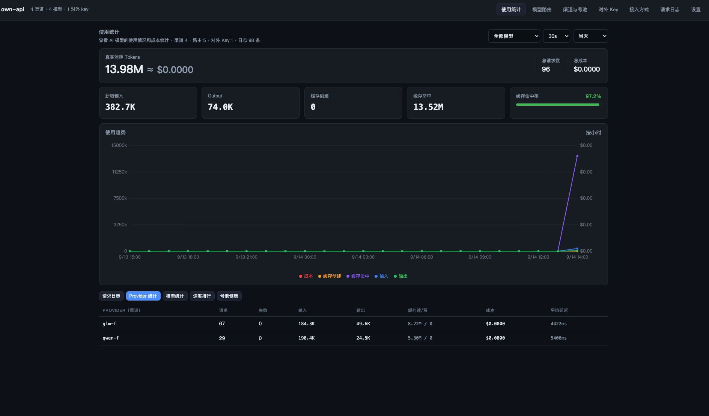

# own-api

[](https://keynowu.github.io/own-api/)
[](https://github.com/KeynoWu/own-api/releases)
[](https://github.com/KeynoWu/own-api/actions/workflows/ci.yml)
[](LICENSE)

本地多模型管理器 + 统一代理网关（号池）：公司发的模型、自己买的各厂商渠道，统一接入、统一路由、统一看账。

一个进程同时提供 **管理台** 和 **统一代理入口**：所有 agent 只配置同一个 base_url + 同一个 key，
把请求里的 `model` 换成哪个名字，网关就自动路由到那个模型对应的真实 `base_url` 与真实 `api_key`。



```
                    ┌──────────────────────────────┐
claude code ──┐     │  http://127.0.0.1:8787/v1    │
codex      ───┼──▶  │  统一 URL + 统一 key          │
自建 agent ───┘     │  ┌────────────────────────┐  │      OpenAI 兼容上游   ──▶ api.openai.com / DeepSeek / …
                    │  │ model 名 → 路由表       │──┼────▶ Anthropic 原生    ──▶ api.anthropic.com
                    │  │ 号池调度 + 协议互转      │  │      本地推理           ──▶ ollama / vllm / lmstudio
                    │  └────────────────────────┘  │
                    └──────────────────────────────┘
```

## 核心能力

| 能力 | 说明 |
| --- | --- |
| 统一入口 | `/v1/chat/completions`（OpenAI 协议）、`/v1/messages`（Anthropic 协议）、`/v1/completions`（legacy 自动转 chat）、`/v1/models`、`/v1/embeddings`。**不支持** OpenAI Responses API（`/v1/responses`，新版 Codex CLI 等默认端点）——这类客户端请改用 chat completions，或在前面挂 litellm 之类转换代理 |
| model 即路由 | 对外只暴露别名（如 `gpt-4o`、`claude-sonnet`），agent 改 `model` 就等于换供应商 |
| auto 自动路由 | 一个对外名（如 `model_auto`）聚合一组候选：按请求硬约束过滤（窗口 / tools / max_tokens / 流式 / 缓存语义）→ 会话粘性（滑动 TTL + 迟滞；持续过慢自动降粘绕行、恢复后回粘）→ `权重 × 健康分 × 饱和退避 × 视觉适配 × 速度因子` 加权随机；失败自动换候选，全链失败才报错。v1 设计见 `docs/model-auto-design.md`，v2 四信号与状态机全录于 `docs/auto-routing-v2-design.md` |
| 跨协议互转 | OpenAI ↔ Anthropic 双向：请求体、非流式响应、SSE 流式、tool_calls、stop_reason、usage 全映射 |
| 号池 | 一个渠道多个 key：加权最小负载轮询；401/429/5xx/超时自动退避冷却并换下一个 key 重试 |
| 限额 | 每个对外 key 的 RPM 与每日 token 上限；在途即计入（并发打不穿），额度落盘（不受日志裁剪影响）。每日 token 的在途预占按请求声明的上限（`max_tokens`/路由 `maxOutputTokens`）估算；都不声明时退化为近似（上界由 RPM 界定） |
| 用量统计 | 逐请求记录 token（含缓存读写）、TTFT、延迟、花费估算；按模型/渠道/key/天聚合 |
| 速度排行 | 按真实模型聚合 TTFT / 总延迟 / 上游错误率 / 中断率 / 失败转移率，慢模型一眼可见；纯观测面，不参与任何路由决策（[设计](docs/speed-insights-design.md)） |
| 配置组导出/导入 | 一键导出全部渠道与路由为 bundle（恒不含密钥）；同事导入走「粘贴→预览→确认+手贴密钥」两步，merge 幂等、撞名必报、同名歧义绝不静默（[设计](docs/config-bundle-design.md)） |
| 一键接入 Agent | 把统一入口的 URL 与 key 直接写进本机 agent 的配置文件（当前支持 **ZCode、omp（oh-my-pi）、Claude Code、dsh**；opencode 在计划内。dsh 写完**不用重启**（它自己监听配置文件）；key 明文只落 dsh 自己的凭据库那一格，不写进 settings。其中 Claude Code **未实机验证**——开发机上已卸载，字段形态取自残留配置的真实键集，行为一条没测过）：识别装在哪、按这把 key 的权限投影模型清单、写前给你看 diff、原文件自动备份、写完探针自检、随时撤销（只删我们自己那一块，被我们改过的角色槽还原成你原来的值）。写入只在本机直连时开放，请求里没有路径参数可传（[设计](docs/agent-import-design.md)） |
| 管理台 | 渠道与号池、模型路由（单模型/自动路由同页管理，新增时选类型；含候选健康分/速度因子/粘性/饱和运行时视图）、对外 key、使用统计首页（趋势/成本/缓存命中）、实时日志、接入代码片段，全部可视化操作 |
| 零依赖部署 | 状态存单个 `data/db.json`，无数据库；Node ≥ 20 即可运行 |

## 桌面安装（推荐，零依赖）

去 [Releases](../../releases) 下载对应平台安装包：

| 平台 | 文件 | 说明 |
| --- | --- | --- |
| macOS（Apple 芯片 M1/M2/…） | `own-api_x.x.x_aarch64.dmg` | 拖进"应用程序"即可 |
| macOS（Intel） | `own-api_x.x.x_x64.dmg` | 同左；首次冷启动稍慢（Rosetta 翻译预热） |
| Windows | `own-api_x.x.x_x64-setup.exe` | 当前用户安装，无需管理员 |

装好运行后：托盘（macOS 菜单栏）出现 own-api 图标 → 服务自动启动 → 浏览器自动打开管理台
（令牌已自动带上，无需复制）。首次启动如被系统拦截：macOS 14 及更早右键图标 →"打开"；
Windows"更多信息 → 仍要运行"（未购买代码签名证书，属预期提示）。
macOS 15+ 提示「已损坏，无法打开」见下一节。

### macOS 提示「已损坏，无法打开」？

**先说结论：应用没有损坏**，这是 Gatekeeper 对未签名应用的隔离误报。安装包未购买 Apple 开发者签名，
从浏览器下载后 macOS 会给文件打上隔离标记（quarantine）；在 macOS 15（Sequoia）及以后，系统对这类
未签名应用取消了「右键 → 打开」的豁免入口，直接报「"own-api" 已损坏，无法打开，您应该将它移到废纸篓」。
应用本身完整、不含病毒，只是缺一张苹果付费签名。

把应用拖进「应用程序」后，终端执行一条命令移除隔离标记即可正常打开：

```bash
xattr -dr com.apple.quarantine /Applications/own-api.app
```

- 提示「Operation not permitted」：在 系统设置 → 隐私与安全性 → 完全磁盘访问 里给你的终端 App
  （Terminal/iTerm）授权后重试
- 不想用命令行：系统设置 → 隐私与安全性 → 安全性 区块里找到关于 own-api 的拦截提示，点「仍要打开」
- macOS 14 及更早版本：右键图标 →「打开」的老办法仍然有效

- 数据（渠道/key/日志）存 `~/.own-api/`，卸载重装不丢；删掉即全新开始
- 托盘菜单：打开控制台 / 打开数据目录 / 开机自动启动 / 退出（退出会连带关停服务，不留孤儿端口）
- 端口被占自动 +1 避让；也可在环境变量里设 `OWN_API_PORT` 固定

## 源码运行（开发者）

```bash
npm install
npm start                 # 启动网关 + 管理台（默认 http://127.0.0.1:8787）
```

桌面壳本地构建：`npm run desktop:build`（需 Rust 工具链；产物在 `src-tauri/target/release/bundle/`）。
环境变量统一 `OWN_API_*` 前缀（历史 `LLM_*` 仍兼容）：`OWN_API_DATA_DIR` / `OWN_API_PORT` /
`OWN_API_HOST` / `OWN_API_ADMIN_TOKEN` / `OWN_API_OPEN_BROWSER=1`。

启动后会打印 **管理令牌** 和 **默认对外 key**。打开管理台，按下面三步就能用：

1. **渠道与号池** → 新增渠道：填上游 Base URL（`https://api.openai.com/v1` 或 `https://api.anthropic.com`）、
   选协议、把多个 key 一行一个粘进去。可点「测试连通」逐个 key 验证，并把上游模型一键导入路由表。
2. **模型路由** → 「+ 新增模型」时选类型：
   - **单模型路由**：`对外模型名` = agent 请求里写的 `model`；`上游真实模型名` = 供应商那边的真名。
     顺手填输入/输出单价，花费统计才有数。
   - **自动路由**（可选）：一个对外名（如 `model_auto`）聚合一组单模型候选，每行一个加权重，
     agent 的 `model` 直接写 auto 名。哪个健康、哪个吃得住这个请求，请求就去哪；挂了自动换下一个。
   两类同页管理、同一张路由表（撞名全局互斥；auto 候选只能引用单模型路由）。
3. **对外 Key** → 新建一个 key（可按 agent 分：claude-code / codex / 团队 A，支持只允许部分模型、RPM 与每日 token 上限）。

### 没有真实 key 也能先看效果

```bash
npm run mock              # 终端 A：假上游（OpenAI + Anthropic 双协议，内置 401/429/500 场景）
npm start                 # 终端 B：网关，OWN_API_ADMIN_TOKEN=demo-token npm start 可固定令牌（旧 LLM_ADMIN_TOKEN 同认）
npm run seed              # 终端 C：灌演示渠道/模型并打几发请求
```

### 接入各 agent

管理台「接入方式」页有可直接复制的片段，等价于：

```bash
# 任何 OpenAI 兼容客户端
export OPENAI_BASE_URL="http://127.0.0.1:8787/v1"
export OPENAI_API_KEY="sk-lm-..."

# Claude Code / Anthropic SDK（走 /v1/messages，可路由到任意上游）
export ANTHROPIC_BASE_URL="http://127.0.0.1:8787"
export ANTHROPIC_API_KEY="sk-lm-..."
```

```js
// 换模型 = 换供应商，agent 侧不需要任何其它改动
const r = await client.chat.completions.create({
  model: 'claude-sonnet',            // 改成 'gpt-4o' 就走另一条渠道和另一套真实 key
  messages: [{ role: 'user', content: 'hi' }],
});
```

上面是**手动**路线（复制片段）。还有一条**自动**路线：管理台「对外 Key」页每行的「接入 Agent」，
把 URL 与 key 直接写进 agent 自己的配置文件——它会先告诉你装了哪些 agent、将要改哪几行，
确认后写入（原文件先备份成 `<文件>.own-api-bak`），写完可以点探针自查，也能一键撤销。

两条路的区别不是方不方便，而是**能不能带上模型清单**：手动片段只能给一个 URL 和一把 key，
agent 里的模型列表得你自己抄；自动写入投影的是「这把 key 此刻真能调的那些模型」（与
`GET /v1/models` 同一个来源），包括 `model_auto` 这种自动路由名，路由表改了还能重新同步。
对 omp 这类有**角色路由表**的 agent，向导会让你勾选接管哪几个槽（默认只勾 `default`）：
没勾的槽一个字不动，写进去的原值会记账，撤销时逐键还原。
路由表改了、网关换了端口、配置被别的工具覆盖，都在「已接入」那一行点 **同步**——它同样先给你看 diff 再写。
写入仅接受本机直连（`127.0.0.1`），且接口不接受路径参数——细节见
[一键接入 Agent 设计](docs/agent-import-design.md)。

## 工作原理

**路由解析**：`model` → 命中模型路由表（对外名或别名标签）→ 渠道 + 上游真名 + 协议。
未登记的模型默认返回 404（附带可用模型列表）；在「设置」里指定兜底渠道后，未知模型会原样透传给该渠道。
auto 路由名优先于兜底渠道：auto 没有可用候选时报 404 附逐候选理由，绝不会漏进兜底渠道。

**auto 自动路由**（`src/auto.ts` + 网关候选链）：`model` 命中 auto 名后，先按本请求的硬约束逐个过滤候选
（上下文窗口、tools 支持、max_tokens 上限、流式支持、anthropic 缓存语义、key 授权、号池可用性），
再看会话粘性（key+auto 名维度，命中滑动续期，迟滞带 0.4/0.6 防抖；粘性候选首字延迟持续 ≥3× 自身基线
会临时降粘绕行——绑定保留不续期，恢复后迟滞自动回粘），否则按 `权重 × 健康分 × 饱和退避 × 视觉适配 × 速度因子`
加权随机（v2.3 统一权重公式）：健康分是 10 分钟成功/失败窗口；同渠道跨 key 连续 429/超时会进饱和态整段避让
（指数退避 + 24h 帽，剩 <5s 的尾段仍给一次探测机会）；带图请求对不认识图片的候选软排除、不认识的降权；
速度因子按流式实测吞吐折算（EMA 平滑 + 1h 半衰期 + 冷启动守卫），快者多让流量、慢者降权。
候选判负自动换下一个（429 只剔候选不计健康分；prompt 超窗这类 400 也续链）。健康分是 10 分钟内存窗口
（全局共享，直连流量同样计入；客户端取消双向剔除）；粘性/健康分重启即清空。一次请求跨候选的总耗时
由链预算（默认 300s，本地模型加载慢所以给得宽）界定。响应体 `model` 恒为 auto 名，真实去向写日志
`routedTo`，统计页 `byRoutedTo` 按真实去向聚合；跨候选失败明细默认回显在错误体里（key 一律打码）。

**协议转换**（`src/translate.ts` + `src/sse.ts`）：
入口决定 *客户端协议*，路由决定 *上游协议*，两者不同才做转换。
同协议流式默认零改写透传（原始字节不动），只在同一条链路里旁扫 usage；
只有当对外别名与上游真名不同时才逐帧改写 `model`，避免对外泄漏上游真实模型名。
整条链路单路可取消：客户端断开会一路传导回上游并停止计费。

上游不按规范来时也有兜底：不声明 / 乱声明 `content-type` 会先窥探首块再判定是 SSE 还是整块 JSON；
上游忽略 `stream` 直接回 JSON 时，网关会把完整响应合成成合法 SSE，而不是回一个空流。

**超时是两层**：首包超时（`defaultUpstreamTimeoutMs`）+ 响应体空闲超时（`upstreamIdleTimeoutMs`）。
只给响应头设超时是不够的——上游回了 200 之后卡死，客户端会永久挂着。

**号池调度**（`src/pool.ts`）：按 `历史请求数 / 权重` 选最空闲的 key。失败分类处理：

| 上游返回 | 处理 |
| --- | --- |
| 401 / 403 | 该 key 冷却 ≥5 分钟，换下一个 key 重试 |
| 429 | 按 `Retry-After` 或失败次数指数退避，换 key 重试（`Retry-After` 夹在冷却基数与上限之间，上游给个离谱值也停不了几天） |
| 5xx / 超时 / 网络错误 | 累计到失败阈值后冷却，换 key 重试 |
| 4xx（其它） | 判定为请求本身有问题，**不换 key 重试**，直接返回（避免打爆号池） |

冷却到期的 key 自动回到可用集合，无需手工干预；管理台里也可一键「恢复」。

**记账**：非流式直接读 `usage`；流式从最后一个含 usage 的事件提取（OpenAI 上游会自动注入
`stream_options.include_usage`，上游不支持时自动回退）。客户端中途断开也会落一条部分用量的日志；
流中途报错会记 502 并向客户端发出协议内合法的 `error` 事件，而不是把连接悄悄掐掉。

**token 口径**：Anthropic 的 `input_tokens` **不含**缓存部分，OpenAI 的 `prompt_tokens` **含**。
统一归一成"含缓存的总输入 token"，缓存读写量单列，花费估算才对两种上游都成立。

**降级会说话**：跨协议时被丢弃的参数（如 `response_format`、`n>1`、`logprobs`）会降级处理
（`response_format` 转成 system 指令）并通过 `x-lm-warning` 响应头告知，不静默变行为。

## 自测

```bash
npm test         # 300 项：对"理想上游"的功能面（鉴权/同协议/跨协议/流式/号池/用量/边界 + auto 全套：
                # 硬过滤/粘性迟滞/续链与终态/ACL/链预算/断开止损/key 泄漏哨兵 + 饱和态/视觉三态/速度因子与粘性慢降级全套
                # + 配置组导出/dryRun 等价/幂等/双实例往返 + 审查修复轮：两段式提交三态、限额预占与并发拒绝、
                # 估算器口径、速度因子端到端分化、采样准入负向（15/16 线/非流式/direct））
npm run test:hard # 191 项：对"脏上游"的加固回归 + 前端 DOM 桩（CRLF 分帧、JSON 冒充流式、卡死、离谱 Retry-After、断开 499、
                # sniff 窗取消复查、慢客户端停读不误杀健康流、饱和/速度状态机时钟注入钉…）
npm run test:all  # 两把一起跑
```

`test/hardening.ts` 用一个故意不规范的脏上游，把代码审查中发现的缺陷逐条固化成断言：

| 场景 | 断言的东西 |
| --- | --- |
| `\r\n` 分帧的 SSE | 内容不丢、能收到 `[DONE]`、usage 不丢；`\r` 恰好断在块边界也不制造假帧边界（多行帧按规范合并） |
| 上游用 JSON 冒充流式 | 不回空响应，token 记账正确 |
| 上游 200 回 `null` / 标量 | 协议内 502 JSON、正常落库、每日额度在途预占不泄漏 |
| `content-type=text/plain` 的真流 | 仍然被当流处理（不轻信响应头） |
| 上游 200 后卡死 | 被空闲超时切断，不挂住客户端 |
| 客户端中途断开 | 上游随之停止生成（不再多烧 token） |
| 离谱 `Retry-After` | 被夹进冷却上限 |
| 并发打满 rpmLimit / 每日 token 并发越界 / 裁掉日志 | 限额仍然生效，不被并发打穿；限额小于单请求预占时仍放行当日首發（不硬锁 key） |
| 非法设置项 | 被拒并说明原因，而不是静默改成危险值 |
| 内部信息暴露 | `x-lm-*`（含重试计数）默认关闭；非本机 Origin 拿不到 CORS 许可 |
| 转换层 | legacy `prompt` 与 legacy **流式结构**、assistant 预填充、孤立 `tool_result`、`response_format` 告警 |
| usage 口径 | OpenAI→Anthropic 响应的 `input_tokens` 不含缓存（Anthropic 客户端求和不双算） |
| 数据完整性 | 模型改名撞名返回 409、`PATCH` 改不动主键与号池 keys、`db.json` 权限 0600 |

## 配置

环境变量：

所有变量都认 `OWN_API_*` 新前缀；下表"旧名"仍兼容（同存时新前缀优先）：

| 变量（旧名） | 默认 | 说明 |
| --- | --- | --- |
| `OWN_API_PORT` / `OWN_API_HOST`（`PORT` / `HOST`） | `8787` / `127.0.0.1` | 监听地址。要局域网可用设 `OWN_API_HOST=0.0.0.0` |
| `OWN_API_ADMIN_TOKEN`（`LLM_ADMIN_TOKEN`） | 随机生成 | 管理台令牌。固定它才不会每次重启都变 |
| `OWN_API_DATA_DIR` / `OWN_API_DB_FILE`（`LLM_DATA_DIR` / `LLM_DB_FILE`） | `~/.own-api` | 状态文件位置；工作目录已有 `./data/db.json` 时开发兼容继续用它 |
| `OWN_API_UPSTREAM_TIMEOUT`（`LLM_UPSTREAM_TIMEOUT`） | `300000` | 上游首包超时（ms） |
| `OWN_API_IDLE_TIMEOUT`（`LLM_IDLE_TIMEOUT`） | `120000` | 流式响应体最大空闲（ms） |
| `OWN_API_MAX_BODY_BYTES`（`LLM_MAX_BODY_BYTES`） | `67108864` | 请求体上限，超限 413 |
| `OWN_API_MAX_RETRIES`（`LLM_MAX_RETRIES`） | `3` | 单请求最多尝试的 key 数 |
| `OWN_API_AUTO_CHAIN_SECONDS`（`LLM_AUTO_CHAIN_SECONDS`） | `300` | auto 一次请求跨所有候选的总耗时预算（每次尝试的头/空闲超时都按剩余预算收缩） |
| `OWN_API_DEBUG_HEADERS`（`LLM_DEBUG_HEADERS`） | 关闭 | 置 `1` 才返回 `x-lm-channel` / `x-lm-key` 等内部头 |
| `OWN_API_CORS_ORIGIN`（`LLM_CORS_ORIGIN`） | 仅本机 | 额外放行的 Origin，逗号分隔；`*` 表示全放（不建议） |
| `OWN_API_OPEN_BROWSER` | 关闭 | 置 `1` 启动后自动开浏览器（走一次性交接票据） |

「设置」页还能调：未知模型兜底渠道、auto 链预算、进入冷却的失败阈值、冷却基数/上限、日志保留条数。

## 注意

- 默认只监听 `127.0.0.1`。需要给局域网内的 agent 用时，自行设 `HOST=0.0.0.0` 并确保处于可信网络——
  网关持有全部上游 key，对外暴露等于把它们交给了同一网络的人。
- 管理台返回的 key 默认脱敏；`?reveal=1` 明文仅对**本机回环直连**生效（经反向代理一律拒绝）。
  管理令牌本身不再随 `GET /api/settings` 回显（只有 `adminTokenSet` 标志）。
- 上游 key 明文存在数据目录的 `db.json`（写入即 `0600` + fsync），请把该文件当作机密对待（已在 `.gitignore` 中）。
  Windows 无 POSIX 权限位：请把数据目录放在当前用户独占的目录（必要时用 EFS/BitLocker 兜底）。
- 管理令牌只接受 `x-admin-token` 请求头；`/api/logs/stream` 因 `EventSource` 无法带自定义头，改用
  `/api/logs/stream/ticket` 换取**短期（10 分钟）SSE 订阅令牌**再以 `?ticket=` 订阅；
  浏览器 URL 交接改走 60 秒一次性 `#handoff` 票据（`POST /api/auth/handoff` 换回令牌），长期令牌不进 URL。
- 鉴权失败有限速：管理台每来源 20 次/分、网关每来源 30 次/分（chat / messages / count_tokens / models 共享同一桶），超限 429。桶键为 TCP 对端地址（XFF 自报头不采信）；只计鉴权失败、成功不增不清——合法 key 无法替爆破者洗白计数。注意：服务挂在反向代理后面时所有用户的对端都是代理地址、共用同一只桶，任一人超阈值会连坐全体 60 秒——反代侧请自配按 IP 限速。
- `/v1/messages/count_tokens` 与推理入口共用同一把 key 的 RPM 准入与每日额度闸门，不是免费端点。
- CORS 默认只放行 `localhost` 来源；`x-lm-*` 内部头默认不下发给 agent。

## 目录

```
src/
  app.ts          路由装配（网关入口 + 管理 API + 管理台静态页）
  index.ts        进程启动与优雅退出
  gateway.ts      统一入口主流程：鉴权 → 路由 → 号池重试 → 出参 → 记账
  pool.ts         号池选取与失败退避策略
  translate.ts    OpenAI <-> Anthropic 请求/响应体转换、usage 归一
  sse.ts          SSE 分帧（兼容 CRLF）、跨协议流转换、同协议零改写透传 + 同路 usage 旁扫
  upstream.ts     上游 URL/鉴权头构造与调用
  usage.ts        花费估算、限流准入与按天配额、统计聚合
  config-bundle.ts 配置组导出/导入（校验+计划+落盘，dryRun 与提交同一构建器）
  agent-import.ts  一键接入 Agent（适配器表 + 唯一被允许写数据目录之外的模块：merge-only + 原子写 + 回读校验）
  admin.ts        管理 API（渠道/号池/模型/key/日志/统计/设置/接入片段）
  store.ts        JSON 文件持久化（去抖落盘 + 原子写）
  mock-upstream.ts假上游，用于无 key 自测
web/index.html    管理台（无构建步骤，单文件）
test/e2e.ts       端到端自测（理想上游）
test/hardening.ts 加固回归（脏上游，固化审查发现）
scripts/seed-demo.ts  演示数据
```

## 协议

[MIT](LICENSE)。随便用、随便改、随便集成，保留版权声明即可；本仓库的源码、管理台与 `docs/` 设计文档同协议。

一如既往：上游 key、路由配置与用量数据全部留在你本机（数据目录 `~/.own-api`），本软件不联网上报、不含任何遥测。
